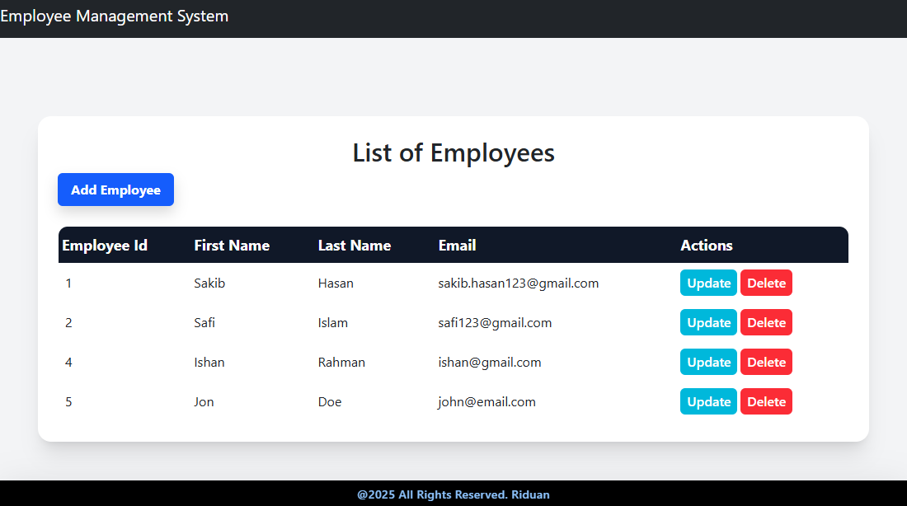

# Employee Management System

Full-stack Employee Management System built with React and Spring Boot. Easily manage employee records with a beautiful, responsive UI and robust REST API.

## 🖼️ Preview

<p align="center">
  
</p>

## Features
- List, add, update, and delete employees
- Form validation for employee data
- Modern UI with Tailwind CSS
- RESTful backend with Spring Boot

## Tech Stack
- **Frontend:** React, Tailwind CSS, Axios
- **Backend:** Spring Boot, Java, Maven
- **Database:**  MySQL 

## Getting Started

### Prerequisites
- Node.js & npm
- Java & Maven

### Backend Setup
1. Navigate to the `backend` folder:
   ```sh
   cd backend
   ```
2. Install dependencies and run the server:
   ```sh
   ./mvnw spring-boot:run
   ```
   The backend will start at `http://localhost:8080`.

### Frontend Setup
1. Navigate to the `frontend` folder:
   ```sh
   cd frontend
   ```
2. Install dependencies:
   ```sh
   npm install
   ```
3. Start the development server:
   ```sh
   npm run dev
   ```
   The frontend will start at `http://localhost:3000`.

## Usage
- Access the app at `http://localhost:3000`
- Add, update, or delete employees using the UI
- All changes are reflected in the backend database

## Folder Structure
```
Employee-Management-System/
├── backend/      # Spring Boot backend
├── frontend/     # React + Tailwind frontend
└── README.md     # Project documentation
```